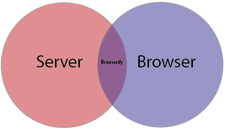

# Browserify

Use your modules, plus already existing node core modules, in the browser

* includes assert, path, url, crypto, domain, events, querystring, util, buffer, etc&hellip;
* bundles up modules into one file, increasing performance

## What Code is a Good Candidate for Browserify?

Anything you want to use on the server and in the browser.

* Validation - ensuring data from the user is in an acceptable format. For example, an email must have an @ sign and a "."

## Alternatives to Browserify

* RequireJS
* ECMAScript 6 built in modules
* Others

## Automation and Distribution

* grunt-contrib-concat
  * For JS
  * can be replaced by Browserify
* grunt-contrib-copy
  * For HTML, Images, plain CSS
* grunt-contrib-connect
* grunt-contrib-watch

##  But wait, what about Bower?

* `bower install` does not modify package.json
* You could still use `<script>` tags, but that’s missing out on the good stuff
* Use the [debowerify](https://github.com/eugeneware/debowerify) transform package from npm to link bower+browserify

## More Resources

*  http://learnjs.io/blog/2013/12/22/express-and-browserify/
* http://superbigtree.tumblr.com/post/54873453939/introduction-to-browserify
* Read about the use case for browserify:
  * http://lincolnloop.com/blog/untangle-your-javascript-browserify
* How to make node and browserify talk to one another:
  * https://blog.codecentric.de/en/2014/02/cross-platform-javascript

